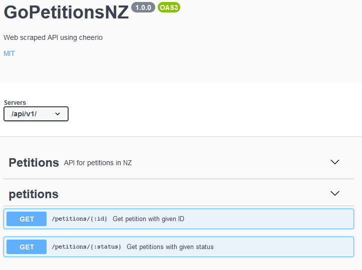

# GoPetitionNZ
A web scraped API that provides online petitions in NZ

# API
## GET /api/v1/petitions/:status
- This fetches a list of petitions with the given status.

### Request
URL params
|params|type|description|required|
|------|----|-----------|--------|
|status|string|Petition status. Can be open, closed, presented|Required|

Query params
|params|type|description|required|
|------|----|-----------|--------|
|page|integer|Page number. Each page show 50 items at max |Optional. Default = 1|

### Response
```json
{
    "status": "open",
    "currentPage": 1,
    "countPerPage": 50,
    "totalPage": 3,
    "totalNumber": 118,
    "petitions": [
        {
            "id": 99776,
            "requester": "Kim Hyunwoo",
            "title": "Express concern to South Korea at actions of diplomat",
            "documentId": "PET_99776",
            "status": "open",
            "closingDate": "21 Sep 2020",
            "signatures": 3
        },
        ...
    ]
}
```

## GET /api/v1/petitions/:id
- This fetches a petition item with the given id.

### Request
URL params

|params|type|description|required|
|------|----|-----------|--------|
|id|integer|Petition id (if document id is PET_99776, just search by 99776) |Requierd|

### Response
```json
{
    "id": 99776,
    "requester": "Kim Hyunwoo",
    "title": "Express concern to South Korea at actions of diplomat",
    "documentId": "PET_99776",
    "status": "open",
    "closingDate": "21 Sep 2020",
    "signatures": 3
}
```

## Swagger document /swagger


# 📌v1.0
## TODO
- [x] getItemList fix
- [x] preflight request issue fix
- [x] API pagination
- [x] Performance enhancement using cache
- [x] Swagger
- [x] Unit tests
- [ ] Deployment
